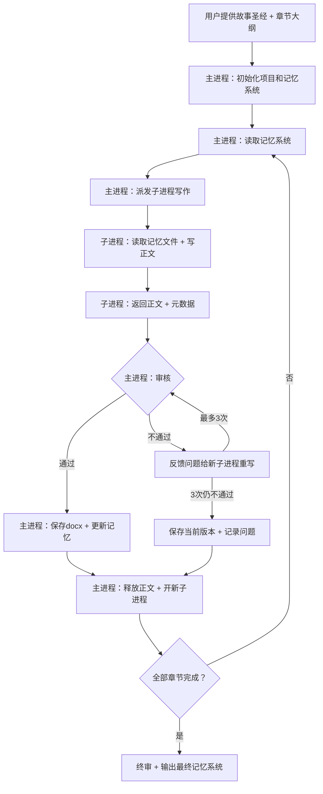

```markdown
# NovelForge

**长篇小说全自动写作系统**

NovelForge 是一个基于 AI 的长篇小说全自动写作系统。你提供故事圣经和章节大纲，NovelForge 自动完成写作、审核、记忆管理、格式检查，直到整部小说完成。

---

## 特点

- **全自动循环**：初始化后无需人工干预，自动逐章写作
- **双进程架构**：主进程负责调度和审核，子进程负责写作，职责分离保证质量
- **三层记忆系统**：全局记忆 + 线索台账 + 近期摘要，解决长篇写作中的上下文衰减问题
- **内容审核**：硬性违禁项 + 警告项 + 语义审核，三级审核保证质量
- **格式标准化**：自动输出格式化的 docx 文件，无需手动排版
- **断点续写**：session 中断后自动恢复，不丢失进度
- **异常自愈**：子进程异常时自动排查，5轮处理流程无需人工介入
- **阶段审核**：每50章自动暂停，对线索台账进行全面审查

---

## 工作原理



每章执行流程：读取记忆 → 派发子进程写作 → 审核 → 保存 → 更新记忆 → 释放正文 → 开新子进程 → 下一章

---

## 部署方式

NovelForge v1.0.7 以 **OpenClaw skill** 形式部署。

### 前置条件

- [OpenClaw](https://github.com/anthropics/openclaw) 已安装并配置
- 一个写作 agent

### 安装步骤

1. 复制完整的工作流 prompt（见 `novelforge-v1.0.7.txt`）
2. 在 OpenClaw 中创建 skill，将 prompt 粘贴进去
3. 将 skill 绑定到你的写作 agent

部署完成后，agent 自动加载 skill，无需每次粘贴。

---

## 使用方法

### 四种触发指令

| 指令 | 模式 | 场景 |
|------|------|------|
| `开始写xxxx小说` | 全新写作 | 从零开始，需要提供故事圣经、章节大纲、总章数、每章字数 |
| `继续写xxxx小说` | 断点续写 | session 重置或中断后恢复 |
| `从第X章开始续写xxxx小说` | 导入续写 | 已有部分章节，需要提供故事圣经、章节大纲、已有章节文件 |
| `继续导入xxxx小说` | 导入断点恢复 | 导入过程中中断后恢复 |

### 必须提供的材料

| 材料 | 说明 |
|------|------|
| 故事圣经 | 世界观设定、核心角色档案、主线/支线剧情框架 |
| 章节大纲 | 每一章的剧情要点，越详细越好 |
| 总章节数 | 整部小说的章节数 |
| 每章目标字数 | 默认 2500 字 |

### 可选提供的材料

- 已有的审核标准
- 写作风格要求（文风、人称、叙事视角等）
- 其他特殊要求

---

## 项目结构

开始写作后，NovelForge 自动在桌面创建以下文件结构：

```
桌面/小说项目/
├── 原始材料/
│   ├── 故事圣经.docx        # 用户提供的故事圣经（初始化后封存）
│   └── 章节大纲.docx        # 用户提供的章节大纲（初始化后封存）
├── 记忆系统/
│   ├── 全局记忆.docx        # 世界观规则 + 角色档案 + 故事进度
│   ├── 线索台账.docx        # 角色状态 + 物品道具 + 伏笔 + 时间线
│   ├── 近期摘要.docx        # 最近8章摘要（滑动窗口）
│   ├── 章节大纲索引.docx    # 按章拆分的大纲
│   ├── 写作进度.docx        # 当前进度 + 断点信息
│   └── 导入进度.docx        # 导入模式专用
├── 章节/
│   ├── 第001章.docx
│   ├── 第002章.docx
│   └── ...
└── 审核记录/
    ├── 第050章阶段审核.docx
    ├── 终审报告.docx
    └── ...
```

---

## 记忆系统

NovelForge 的核心设计。解决 AI 写长篇小说时的上下文衰减问题。

| 文件 | 作用 | 更新频率 |
|------|------|----------|
| 全局记忆 | 世界观规则、角色档案、故事进度 | 仅在有变化时更新 |
| 线索台账 | 角色状态、物品道具、伏笔、时间线 | 每章更新 |
| 近期摘要 | 最近8章的摘要 | 每章更新（滑动窗口） |
| 章节大纲索引 | 按章拆分的大纲 | 初始化时生成，不更新 |
| 写作进度 | 当前进度和断点信息 | 每章更新 |

主进程每章只读取需要的记忆内容，不是全部传给 AI，有效控制 token 消耗。

---

## 审核标准

### 硬性错误（发现即打回重写）

- ❌ "不是...而是..." 句式
- ❌ 破折号「——」
- ❌ 章节号指称（第X章、chapter X）
- ❌ 分析报告术语（核心动机、信息落差、认知共鸣等）
- ❌ 未设定的人物/地名
- ❌ 真实地名（除非大纲明确）
- ❌ 违背现实逻辑的情节
- ❌ Markdown 格式符号（*、#、-、_、```、> 等）

### 警告项（标注位置要求修改）

- ⚠️ 转折词密度：每2000字不超过1次
- ⚠️ 高疲劳词：同词每章只出现1次
- ⚠️ 元叙事/编剧旁白
- ⚠️ 说教词
- ⚠️ 集体震惊套话
- ⚠️ 连续6句以上含"了"字
- ⚠️ 段落过碎（50-250字/段）
- ⚠️ 章节标题重复

### 审核流程

1. 本地硬性检查（代码级别，不会漏）
2. AI 语义审核（逻辑、连贯性、大纲一致性）
3. 审核不通过 → 反馈给子进程重写（最多3次）
4. 3次仍不通过 → 保存当前版本 + 记录审核问题 → 继续下一章

---

## 异常处理

子进程异常时，NovelForge 自动执行5轮排查：

| 轮次 | 操作 |
|------|------|
| 第一轮 | 原始重试3次 |
| 第二轮 | 检查记忆系统文件，修复后重试 |
| 第三轮 | 精简传入内容，只传最核心信息 |
| 第四轮 | 等待10分钟冷却后重试 |
| 第五轮 | 暂停写作，等待人工介入 |

全程自动执行，不中断、不通知。

---

## Token 消耗预估

以每章 2500 字、500 章长篇小说为例：

| 项目 | 数量 |
|------|------|
| 每章 token 消耗 | 约 20,000 |
| 500 章总计 | 约 1,000-1,100 万 token |
| 阶段审核 + 异常重试 | 额外约 10% |

---

## 版本历史

| 版本 | 核心变更 |
|------|----------|
| v1.0.0 | 初版：双进程架构、三层记忆系统、审核标准 |
| v1.0.1 | 章节大纲索引、断点续写、导入模式、阶段审核优化 |
| v1.0.2 | 文件封存、元数据异常处理、触发方式带项目名 |
| v1.0.3 | 导入模式逐章读取、导入进度追踪 |
| v1.0.4 | Cron 守护自动恢复、静默模式 |
| v1.0.5 | 子进程异常5轮排查、45分钟超时阈值 |
| v1.0.6 | 部署为 OpenClaw skill |
| v1.0.7 | 禁止 Markdown 格式符号 |

---

## 已知限制

- 依赖 OpenClaw 平台的 session 机制
- 长时间运行可能因 session 上下文膨胀导致中断（通过 cron 守护自动恢复）
- 每章写作质量受底层 AI 模型能力影响
- 中文指令在复杂流程中可能存在步骤遗漏（通过加强提示词缓解）

---

## 后续计划

- [ ] v2.0.0：Python + AI 混合架构，流程控制由代码保证
- [ ] 更多违禁规则
- [ ] 多语言支持

---

## License

MIT
```

---

更新到 GitHub 后，Mermaid 流程图会自动渲染成带箭头的彩色图形。GitHub 原生支持 Mermaid，不需要装任何插件。
