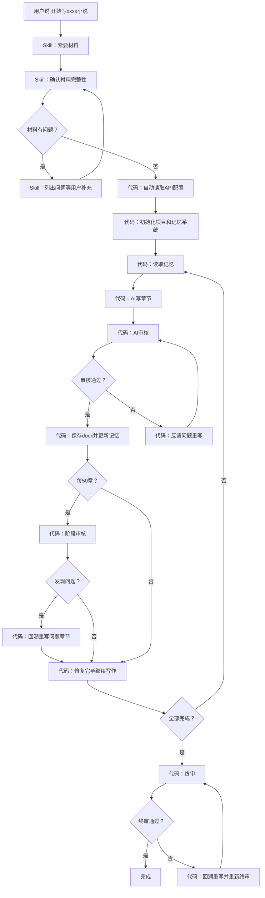

# NovelForge

**长篇小说全自动写作系统**

NovelForge 是一个基于 AI 的长篇小说全自动写作系统。你提供故事圣经和章节大纲，NovelForge 自动完成写作、审核、记忆管理、格式检查，直到整部小说完成。

---

## 特点

- **全自动循环**：初始化后无需人工干预，自动逐章写作
- **双层架构**：OpenClaw Skill 负责启动前交互，Python 代码负责流程控制
- **三层记忆系统**：全局记忆 + 线索台账 + 近期摘要，解决长篇写作中的上下文衰减问题
- **内容审核**：硬性违禁项 + 警告项 + 语义审核，三级审核保证质量
- **格式标准化**：自动输出格式化的 docx 文件，无需手动排版
- **断点续写**：程序中断后自动恢复，不丢失进度
- **异常自愈**：写作异常时自动排查，4轮处理流程无需人工介入
- **阶段审核**：每50章自动暂停，发现问题立即修复后才继续
- **终审**：全部完成后终审，发现问题立即修复，最多重审3轮
- **API自动配置**：自动从 OpenClaw 配置文件读取 API 信息，无需手动填写

---

## 工作原理



---

## 架构

NovelForge 分为两层：

| 层级 | 职责 |
|------|------|
| **OpenClaw Skill** | 启动前交互：索要材料、确认完整性、检查逻辑矛盾 |
| **Python 代码** | 流程控制：写作循环、审核、保存、记忆更新、异常处理、阶段审核、终审、API配置读取 |

| 组件 | 说明 |
|------|------|
| `OpenClawConfigReader` | 自动从 `~/.openclaw/openclaw.json` 读取 API 配置 |
| `AIInterface` | AI 调用封装，每次调用独立 HTTP 请求，无状态 |
| `MemorySystem` | 三层记忆系统管理（全局记忆、线索台账、近期摘要） |
| `DocxHandler` | docx 格式化、保存、格式检查、自动修复 |
| `ReviewStandards` | 硬性错误和警告项的本地检查 |
| `PromptBuilder` | 构建发送给 AI 的提示词 |
| `NovelForge` | 主系统，控制整体流程 |

---

## 部署方式

NovelForge 以 **OpenClaw skill + Python 代码** 双层部署。

### 前置条件

- [OpenClaw](https://github.com/anthropics/openclaw) 已安装并配置
- Python 3.8+
- 一个写作 agent
- OpenClaw 中已配置 AI API（如 MiniMax、MiMo 等）

### 安装步骤

1. 安装 Python 依赖：

```bash
pip install openai python-docx
```

2. 将 `novelforge.py` 放在合适的位置

3. 在 OpenClaw 中创建 skill，将以下 skill 描述粘贴进去，并绑定到你的写作 agent

---

## Skill 描述

将以下内容粘贴到 OpenClaw 中创建 skill：

```
请阅读 novelforge.py 代码，创建一个 OpenClaw skill。

除了代码中已有的逻辑外，skill还需要加入以下启动前交互流程：

当用户说"开始写xxxx小说"时，你必须先完成以下步骤才能调用代码：

第一步：主动向用户索要以下材料

必须提供：
1. 故事圣经（世界观设定、核心角色档案、主线/支线剧情框架）
2. 章节大纲（每一章的剧情要点，越详细越好）
3. 总章节数
4. 每章目标字数（默认2500字）

可选提供：
5. 已有的审核标准（如有，传入代码；如没有，使用内置标准）
6. 写作风格要求（文风、人称、叙事视角等）
7. 其他特殊要求

第二步：逐一确认材料是否完整

第三步：如果有缺失或矛盾，列出具体问题，等用户补充后再次确认

第四步：全部确认无误后，调用代码启动写作

当用户说"继续写xxxx小说"时，不需要重新索要材料，直接调用代码的断点续写模式。

当用户说"从第X章开始续写xxxx小说"时，按第一步到第四步重新索要材料，确认无误后调用代码的导入续写模式。
```

---

## 使用方法

### 三种触发指令

| 指令 | 模式 | 场景 |
|------|------|------|
| `开始写xxxx小说` | 全新写作 | 从零开始，agent 会先索要材料并确认 |
| `继续写xxxx小说` | 断点续写 | 程序中断后恢复，自动读取进度文件继续 |
| `从第X章开始续写xxxx小说` | 导入续写 | 已有部分章节，需要提供故事圣经、章节大纲、已有章节文件 |

### 必须提供的材料

| 材料 | 说明 |
|------|------|
| 故事圣经 | 世界观设定、核心角色档案、主线/支线剧情框架 |
| 章节大纲 | 每一章的剧情要点，越详细越好 |
| 总章节数 | 整部小说的章节数 |
| 每章目标字数 | 默认 2500 字 |

### 可选提供的材料

- 已有的审核标准（为空则使用内置标准）
- 写作风格要求（文风、人称、叙事视角等）
- 其他特殊要求

### API 配置

**无需手动配置。** NovelForge 会自动从 OpenClaw 配置文件（`~/.openclaw/openclaw.json`）读取 API 地址、密钥和模型名称。如果自动读取失败，会提示手动输入。

---

## 项目结构

开始写作后，自动在桌面创建以下文件结构：

```
桌面/{小说名}项目/
├── 原始材料/
│   ├── 故事圣经.docx        # 用户提供的故事圣经（初始化后封存）
│   └── 章节大纲.docx        # 用户提供的章节大纲（初始化后封存）
├── 记忆系统/
│   ├── 全局记忆.docx        # 世界观规则 + 角色档案 + 故事进度
│   ├── 线索台账.docx        # 角色状态 + 物品道具 + 伏笔 + 时间线
│   ├── 近期摘要.docx        # 最近8章摘要（滑动窗口）
│   ├── 章节大纲索引.docx    # 按章拆分的大纲
│   └── 写作进度.docx        # 当前进度 + 断点信息
├── 章节/
│   ├── 第001章.docx
│   ├── 第002章.docx
│   └── ...
└── 审核记录/
    ├── 第050章阶段审核.docx
    ├── 终审报告.docx
    └── ...
```

---

## 记忆系统

NovelForge 的核心设计。解决 AI 写长篇小说时的上下文衰减问题。

| 文件 | 作用 | 更新频率 |
|------|------|----------|
| 全局记忆 | 世界观规则、角色档案、故事进度 | 仅在有变化时更新 |
| 线索台账 | 角色状态、物品道具、伏笔、时间线 | 每章更新 |
| 近期摘要 | 最近8章的摘要 | 每章更新（滑动窗口） |
| 章节大纲索引 | 按章拆分的大纲 | 初始化时生成，不更新 |
| 写作进度 | 当前进度和断点信息 | 每章更新 |

---

## 审核标准

### 硬性错误（发现即打回重写）

- ❌ "不是...而是..." 句式
- ❌ 破折号「——」
- ❌ 章节号指称（第X章、chapter X）
- ❌ 分析报告术语（核心动机、信息落差、认知共鸣等）
- ❌ 未设定的人物/地名
- ❌ 真实地名（除非大纲明确）
- ❌ 违背现实逻辑的情节
- ❌ Markdown 格式符号（*、#、-、_、```、> 等）

### 警告项（标注位置要求修改）

- ⚠️ 转折词密度：每2000字不超过1次
- ⚠️ 高疲劳词：同词每章只出现1次
- ⚠️ 元叙事/编剧旁白
- ⚠️ 说教词
- ⚠️ 集体震惊套话
- ⚠️ 连续6句以上含"了"字
- ⚠️ 段落过碎（50-250字/段）
- ⚠️ 章节标题重复

### 审核流程

1. 本地硬性检查（代码级别，不会漏）
2. AI 语义审核（逻辑、连贯性、大纲一致性）
3. 审核不通过 → 反馈给 AI 重写（最多3次）
4. 3次仍不通过 → 保存当前版本 + 记录审核问题 → 继续下一章

---

## 阶段审核

每50章自动触发：

1. AI 审查线索台账（线索自洽性、人物状态、伏笔、时间线）
2. 只有发现可疑项时，才回溯相关章节原文核实
3. 识别需要重写的章节，逐章修复
4. **全部修复完毕后才继续写作，不会带着问题推进**

---

## 终审

全部章节完成后触发：

1. AI 对线索台账做最终通查
2. 发现问题立即回溯重写
3. 修复后重新终审
4. **最多重审3轮，3轮仍不通过则暂停等待人工介入**

---

## 异常处理

写作过程中 AI 调用失败时，自动执行4轮排查：

| 轮次 | 操作 |
|------|------|
| 第一轮 | 原始重试3次 |
| 第二轮 | 精简传入内容，只传最核心信息 |
| 第三轮 | 等待10分钟冷却后重试 |
| 第四轮 | 暂停写作，等待人工介入 |

全程自动执行，不中断。

---

## Token 消耗预估

以每章 2500 字、500 章长篇小说为例：

| 项目 | 数量 |
|------|------|
| 每章 token 消耗 | 约 20,000 |
| 500 章总计 | 约 1,000-1,100 万 token |
| 阶段审核 + 异常重试 | 额外约 10% |

---

## 版本历史

| 版本 | 核心变更 |
|------|----------|
| v1.0.0 | 初版：双进程架构、三层记忆系统、审核标准（OpenClaw skill） |
| v1.0.1 | 章节大纲索引、断点续写、导入模式、阶段审核优化 |
| v1.0.2 | 文件封存、元数据异常处理、触发方式带项目名 |
| v1.0.3 | 导入模式逐章读取、导入进度追踪 |
| v1.0.4 | Cron 守护自动恢复、静默模式 |
| v1.0.5 | 子进程异常5轮排查、45分钟超时阈值 |
| v1.0.6 | 部署为 OpenClaw skill |
| v1.0.7 | 禁止 Markdown 格式符号 |
| v2.0.0 | Python + AI 混合架构，流程控制由代码保证 |
| v2.0.1 | 修复空方法、severity 字段处理 |
| v2.0.2 | 删除 Cron 守护、异常处理简化为4轮、元数据解析优化 |
| v2.0.3 | 加回材料确认流程、新增可选材料支持 |
| v2.0.4 | 阶段审核发现问题立即修复、终审最多重审3轮 |
| v2.0.5 | API 配置自动从 OpenClaw 读取，无需手动填写 |
| v2.0.6 | 修复中文引号语法错误，代码去掉注释 |
| v2.0.7 | 修复max_tokens截断问题，记忆初始化不再生成outline_index |

---

## 已知限制

- 依赖 OpenClaw 平台和 Python 环境
- 每章写作质量受底层 AI 模型能力影响
- 阶段审核和终审的回溯重写会消耗额外 token

---

## License

MIT
